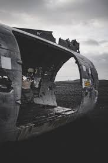

# Notes-Graal-Virtuel
Toutes mes notes cruciales pour retrouver le Graal Virtuel
J'ai enfin localisé et récupéré le Graal, mais il est enfermé dans une archive compressée protégée par une clé spéciale. Voici l’indice pour ouvrir la boîte : **OMI/IMO + DC-3_AVION_REGISTRATION + DC-6_AVION_IMMATRICULATION**.
Au cours de mes recherches, j'ai récupéré des photos des deux avions ayant potentiellement transporté le Graal :

Chaque élément compte pour déverrouiller le Graal Virtuel, bon courage enquêteur !
